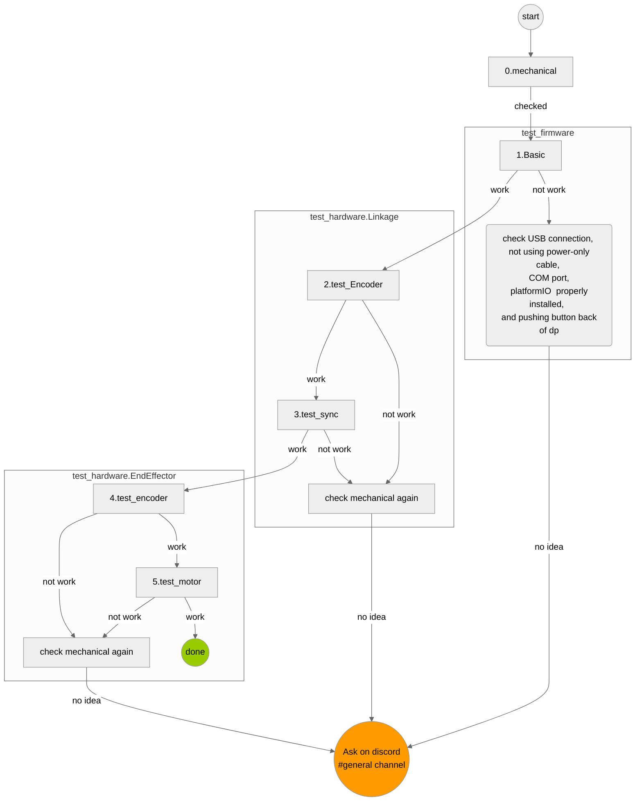

# Dualpanto: Install Firmware & Testing

The purposes of this repository are 

1. to install the dualpanto framework firmware to the dualpanto devices, which is needed for running & developing apps/games (follow the setup section. the actual firmware installation is in step 5)
2. to provide semi-automatic testing for the dualpanto device. This involves basic functionality checks of the hardware, the haptic rendering, communication protocol and the unity integration. A test will install a different testing firmware, which overwrites the dualpanto framework firmware. (follow "If something doesn't work, run these tests")
3. to provide tasks for weekly assignments in [BIS.md](BIS.md)

The `readme.md` is therefore divided into the sections Setup and Testing. If you have already set up your dualpanto, you can [skip to testing](#when-something-doesnt-work-troubleshooting-with-tests).

#### This project is work-in-progress. You are welcome to contribute.

### For BIS participants
Please check [BIS.md](BIS.md) first. That file also contains instructions for the weekly assignments.

# Setup
## 1. Install the ESP32 driver (so your computer can communicate with the dualpanto)
- [Download](https://www.silabs.com/developers/usb-to-uart-bridge-vcp-drivers?tab=downloads) the latest installer of the driver for your OS-Version
- Unzip and run the installer
  * Tips for windows: download "CP210x Universal Windows Driver," right-click on the silabser.inf file, and select _Install_
  * Tips for mac: mount the DMG file and double-click on the	Silicon Labs VCP Driver. If the installation is blocked or won't finish, go to the _System Preferences Security & Privacy_ pane (before Tahoe) or _Login Items & Extensions_ (since Tahoe) to	allow the system extension

## 2. Setup C++ environment (so that C++ code of this repo can be compiled)

### macOS
 - Go to Appstore and install Xcode
 - Run `xcode-select –install` to install the compilers
 - Run `sudo xcode-select -s /Applications/Xcode.app/Contents/Developer`

### Windows
 - Install [Visual Studio](https://visualstudio.microsoft.com/de/vs/older-downloads/) 2019 or 2017 (you won't use this as your IDE, this is just to install the C++ dependency in the next step)
 - Select at least the workload “Desktopentwicklung mit C++”

## 3. Clone repo and install submodules
1. clone this repo **(on Windows: dont clone into the WSL subsystem, it wont work!)**
2. navigate into the project folder "dualpanto-testing" and run `git submodule init`, then `git submodule update`

## 4. Install IDE (this is where you will run the Dualpanto tests)
We highly recommend to use PyCharm to run this test flow, but you can also use VSCode or the command line.
### Alternative A: PyCharm (recommended, because your environment is guaranteed to work)
1. download [PyCharm](https://www.jetbrains.com/community/education/#students). As a student, you get a free license (click the "Apply now" button and complete the form).
2. open the cloned project in PyCharm. If PyCharm shows "Invalid VCS root mapping", [install the submodules](#3-clone-repo-and-install-submodules).
3. [create virtual environment (we use python 3.7)](https://www.jetbrains.com/help/pycharm/creating-virtual-environment.html)
4. [install packages](https://www.jetbrains.com/help/pycharm/managing-dependencies.html#apply_dependencies) from requirements.txt using the quick-fix banner appearing upon opening any of the python files.
5. Install the Mermaid diagramming plugin for PyCharm through PyCharm->Settings->Plugins->Marketplace (search for "Mermaid") or download it here: [Mermaid](https://plugins.jetbrains.com/plugin/20146-mermaid)

**If you need a Terminal in further steps, use the one built into PyCharm. Only in the PyCharm terminal you will get your correct python virtual environment.**

### Alternative B: VScode (can work, but if you already configured your environment in a weird way it might be hard for us to debug)

1. download [VScode](https://code.visualstudio.com/)
2. install the Python extension for VSCode (https://marketplace.visualstudio.com/items?itemName=ms-python.python)
3. go into the extensions menu on the left -> press the settings gear on the Python extension -> select "Settings" -> type "terminal" into the search bar -> make sure that "Activate env in current terminal" and "Activate environment" are both checked. This will ensure that you are always in the correct environment.
4. **On Windows**, use the PowerShell or Command Prompt terminal inside VSCode in all following steps. Don't use the WSL subsystem.
5. open the project folder with VScode
6. shift + command + P -> >Python: Create Environment -> Venv
7. **On windows:** if it says "No python installed", install python from the Microsoft Store (you can get there by clicking the "no python installed" warning). Then go back to VSCode and repeat from step 6.
8. select your python version (e.g. Python 3.12.6) -> select requirements.txt -> confirm
9. it will install for a while (as shown by a message window on the bottom right). When it's done, **open a new terminal**.
10. Check that it worked: Run `pip list` in the terminal, it should show you (among others) `pyserial` and `platformio` in the list.
11. If they dont show up, or you get python errors later such as "no module named serial": press shift + command + P -> Python: Select Interpreter -> select the interpreter which includes venv, e.g. `Python 3.12.6 ('.venv': venv)`. Then open a new terminal. Then try again. **You might have to redo step 11 every time you open VSCode.** If you don't see this interpreter in the list, redo the installation steps above from step 6.

### Alternative C: Command Line (hard, because you get no help with setup from the IDE and do everything yourself from the terminal)
you can also run all unittest from command line interface if struggle with setting up IDE. Install python library in requirements.txt, then execute script.

## 5. Uploading the firmware to the Dualpanto

You need to have the dualpanto connected to your computer to do this. Here is how it works:

1. plug the USB-A end of the USB cable into your computer. If you don't have USB-A (e.g. new laptop), use a USB-C to USB-A adapter.
2. plug the micro-USB-B end of the cable into the Dualpanto. The port is in the top left of the back of the device.
3. Find out your COM port (the COM port is basically the name that your computer gave to the connection to the dualpanto). How to find your COM port: **Windows** : go to device manager / geräte-manager → ports/anschüsse (COM & LPT) and check the com port (e.g. "//.//COM3"). **Mac**: use command `ls /dev/cu.*` in the terminal and look for e.g. "/dev/cu.SLAB_USBtoUART"
4. open `config.py` in the dualpanto-testing folder and put your COM port between the quotes in `COM_PORT = ""`.
5. **Start pressing and holding this button** on the back of the device (image below).

6. In the terminal of your IDE (either PyCharm or VSCode with Python virtual environment), navigate to the dualpanto-testing folder and run this command (or click on it in PyCharm): `python -m unittest test_firmware.UploadDualPantoFramework.test_upload_dp_firmware`. **Keep pressing the button** while this is running.
7. Follow along with the terminal output. When it gets stuck at "„Serial port /dev/cu.SLAB_USBtoUART“ or similar, make sure the button is pressed and wait a few seconds. *(This is the critical step where the button needs to be held down)*
9. After the install is finished (terminal says OK), you can **release the button**. If you got OK and don't run into further problems, dont worry about the error messages.

If all of this worked, you did successfully setup the Dualpanto. If not, see the next section.

## 6. Claibrating Firmware

### Calibration (Instructions)
Before uploading the regular firmware to the device, we can upload `calibrationFirmware` to store some calibration information permanently to the device. For this, bring the handles to the closed position (as far back as possible), and rotate the end effectors into a distinct/memorable position, e.g. facing **precisely** towards you.

1. **Absolute encoders** The linkage encoders (on the big motors) have absolute positioning. When flashing the `calibrationFirmware`, the encoder values are immediately read and permanently stored to non-volatile storage. The device now remembers this position as the closed position. This means that from now on, the handles can be in any position on devive startup, and tracking still works. If no calibration data is present, the regular firmware expects the handles to be in closed position on every start.
2. **Determine the end effector gear ratios**
Unfortunately, there are at least four different end effector gear boxes in circulation at the moment. The `calibrationFirmware` can distinguish between them, and permanently save their type to non-volatile storage. For this, some human input is needed.
For each end effector:
- Rotate the end effector **three times** clockwise (looking from the top). Try to be very precise! Since the difference between gear ratios is rather small, precision is key here. Since the linkage calibration is already done, you can pull the handles out a bit for easier rotation.
- Rotate the end effector counterclockwise for about half a revolution. This signals to the firmware that the calibration is done.

Uploading calibration firmware:
`python -m unittest test_firmware.UploadDualPantoFramework.perform_calibration`

*Remember: The end effector encoders are relative, meaning they still need to be in a known position on startup to register correctly. However, this calibration ensures that the handle rotation has the correct speed.*

When you have finished the calibration, proceed to uploading the regular `firmware`.

# When something doesn't work: Troubleshooting with Tests

## Quick fixes
### Whenever you plug Dualpanto into a new PC, reinstall the firmware
Check [step 5](#5-uploading-the-firmware-to-the-dualpanto) on how to do so.

Known issues when you plug dualpanto device into different PC:
- we observe dualpanto has some wall rendering issue when you connect dualpanto to other PC. e.g, you uplaod firmware from mac and connect to windows pc.
- this doesn't happen always. but You need to keep this in mind.
- We haven't known why so. Welcome you to contribute here!

### Reset and calibrate dualpanto
Press the button right next to the USB port to reset dualpanto. A reset might be needed when:
- handles are stuck in walls or behave in an uncontrolled way
- tracking of handle position is off. In this case, move linkages to home position, turn handles to the right and then reset.

## Running the Tests
- **When you need to ask question on discord, please tell us which test you failed, and describe error or issue you have precise as possible.**
- You can either run the following commands in a console, or in PyCharm view this `readme.md` in formatted markdown and click on them directly    Alternatively, you can still [execute unittest from scripts](https://www.jetbrains.com/help/pycharm/testing-your-first-python-application.html#create-test)
- Some of the test require user input and are not semi-automated, since they are related to haptics and mechanical issues. In this case you will be instructed via the the console output.
- All tests upload a specific firmware for each unit-test. You probably need to push this button on the back of dualpanto when you upload a firmware (it depends on OS).

- If the handles get stuck in walls show uncontrolled behaviour during one of the tests, press the **reset button** next to the power switch.
   
###  Category 1: Mechanical and Hardware Tests
(For BIS students: There is code available to figure out whether encoders and motors work, but no good evaluation process yet. We will update asap. You can also modify code to test your purpose.)

0.  [check mechanical configuration](physical_test/checklist.md)
1. `python -m unittest test_firmware.Basic`
2. `python -m unittest test_hardware.Linkage.test_encoder`**WIP**
3. `python -m unittest test_hardware.Linkage.test_sync`**WIP**
4. `python -m unittest test_hardware.EndEffector.test_encoder` **WIP**
5. `python -m unittest test_hardware.EndEffector.test_motor` **WIP**

Explanations:
- *1. Basic*: Check whether you could compile firmware and upload it with platfiormIO
- *2. Linkage.test_encoder*: Check if the four encoders on top of big motors are working fine
- *3. Linkage.test_sync*: Check if the four big motors are working fine
- *4. EndEffector.test_encoder*: Check if the two encoders on end effectors are working fine
- *5. EndEffector.test_sync*: Check if the two motors on end effectors are working fine

### Category 2: Tests for Rendering Haptics = DualPanto Firmware

0. [check mechanical configuration](physical_test/checklist.md)
1. `python -m unittest test_firmware.Haptics.test_line_wall` **WIP**
2. `python -m unittest test_firmware.Kinematics.test_kinematics_sync` **WIP**
3. `python -m unittest test_firmware.Haptics.test_force_field` **WIP**
4. `python -m unittest test_firmware.Haptics.test_rail` **WIP**
5. `python -m unittest test_firmware.Haptics.test_rectangle_obstacle` **WIP**
6. `python -m unittest test_firmware.Haptics.test_diamond_obstacle` **WIP**
7. `python -m unittest test_firmware.Haptics.test_moving_obstacle` **WIP**

Explanations:
- *1. Haptics.test_line_wall*: Check dualpanto firmware can render simplest wall = line or not
- *2. Kinematics.test_kiematics_sync*: Check forward and inverse kinematics of dualpanto firmware works fine or not

### Category 3: Communication Protocol Tests

**WIP**

### Category 4: Unity Tests

**WIP**

# Feedback
This project is currenty under developement. 
For questions, please reach out to martin.taraz@hpi.de, shohei.katakura@hpi.de

For BIS students, please reach out shohei.katakura@hpi.de
